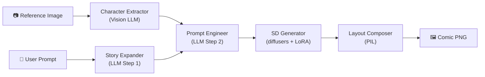

# 🎨 SDXL Manga Generator

> **Reference Image → LLM Story Expansion → LLM Prompt Engineering → Stable Diffusion + LoRA → Fixed-Layout Comic**

An end-to-end pipeline that turns a one-line story idea and a character reference image into a complete multi-panel manga page — powered by local LLMs (via Ollama) and Stable Diffusion XL.



---

## ✨ Features

- **Two LLM stages** — story expansion → SD prompt engineering, fully automated
- **Character consistency** — vision LLM extracts features from a reference image, injected into every panel
- **Drop-in LoRA** — put `.safetensors` in a folder, they load automatically
- **Fixed layouts** — 4-panel (2×2) or 6-panel (3×2) with comic-style borders
- **Auto panel count** — determined by prompt length (≤ 30 words → 4, else 6)
- **Dual interface** — CLI (`main.py`) + Gradio web UI (`app.py` for HuggingFace Spaces)

---

## 📁 Project Structure

```
sdxl-manga-gen/
├── app.py                           # Gradio web UI (HF Spaces entry point)
├── main.py                          # CLI entry point
├── config.yaml                      # Models, LoRA, layout, prompts
├── requirements.txt
│
├── models/
│   └── ollama_model.py              # Lightweight Ollama wrapper (OpenAI-compatible)
│
├── pipeline/
│   ├── character_extractor.py       # Vision LLM → SD character tags
│   ├── story_expander.py            # User idea → panel narratives (LLM Step 1)
│   ├── prompt_engineer.py           # Narratives → SD tag prompts (LLM Step 2)
│   ├── sd_generator.py              # SDXL image generation + LoRA
│   ├── layout_composer.py           # Panel images → comic grid
│   └── manga_pipeline.py           # Orchestrator chaining all steps
│
├── loras/
│   ├── character/                   # ← Drop character LoRA .safetensors here
│   └── style/                       # ← Drop style LoRA .safetensors here
│
└── output/                          # Generated comics
```

---

## 🚀 Quick Start

### 1. Install Dependencies

```bash
pip install -r requirements.txt
```

### 2. Configure

Edit `config.yaml` to set your models and preferences:

```yaml
llm:
  model_name: "qwen3-coder-next:cloud"     # Story & prompt LLM
  vision_model_name: "gemma3:12b"           # Character extraction (multimodal)

sd:
  model_path: "stabilityai/stable-diffusion-xl-base-1.0"
  lora:
    character:
      dir: "loras/character"    # auto-discovers .safetensors
      weight: 0.8
    style:
      dir: "loras/style"
      weight: 0.6
```

### 3. Add LoRA Weights (Optional)

Simply drop `.safetensors` files into the LoRA directories — no code changes needed:

```bash
cp MyCharacter_v2.safetensors loras/character/
cp MangaStyle.safetensors     loras/style/
```

The pipeline auto-discovers and loads them with the weights from `config.yaml`.

### 4. Run

#### CLI

```bash
# With reference image (auto-extracts character tags via vision LLM)
python main.py -r character.png -p "A samurai fighting a robot in the rain"

# With manual character tags (skip vision extraction)
python main.py --character-tags "1boy, silver hair, black coat" \
               -p "A detective solving a mystery in a dark library" \
               --panels 6

# Custom output & seed
python main.py -r ref.png -p "宇宙探险" --seed 42 -o output/space_comic.png
```

#### Gradio Web UI

```bash
python app.py
# → http://localhost:7860
```

#### HuggingFace Spaces

Push the repo to a HuggingFace Space — `app.py` is auto-detected as the entry point.

---

## 🔧 Pipeline Stages

### Step 0 · Character Feature Extraction

| Module | `pipeline/character_extractor.py` |
|---|---|
| Input | Reference image (PNG/JPG/WEBP) |
| Method | Image → base64 → Vision LLM with structured prompt |
| Output | SD tags: `"1boy, silver hair, round glasses, black trench coat"` |
| Fallback | `--character-tags` CLI flag bypasses vision extraction |

### Step 1 · Story Expansion (Narrative Architect)

| Module | `pipeline/story_expander.py` |
|---|---|
| Input | Brief user prompt + panel count |
| LLM Role | Professional Comic Scriptwriter |
| Output | List of panel descriptions (2–3 sentences each) |
| Auto-detect | ≤ 30 words → 4 panels, > 30 → 6 panels |

### Step 2 · Prompt Engineering (SD Engineer)

| Module | `pipeline/prompt_engineer.py` |
|---|---|
| Input | Panel narratives + character tags |
| LLM Role | Expert SD Prompt Engineer |
| Output | JSON: `{ panel_number, camera_angle, sd_prompt }` per panel |

**Backend post-processing** (not done by LLM):
```
[Trigger Words] + [SD Prompt] + [LoRA Tags] + [Quality Suffix]
```

### Step 3 · Image Generation

| Module | `pipeline/sd_generator.py` |
|---|---|
| Engine | HuggingFace `diffusers` (`StableDiffusionXLPipeline`) |
| LoRA | Auto-loaded from `loras/` folders via `load_lora_weights()` |
| Scheduler | DPM++ 2M Multistep |
| Device | Auto: CUDA → MPS → CPU |

### Step 4 · Layout Composition

| Module | `pipeline/layout_composer.py` |
|---|---|
| 4-panel | 2×2 grid |
| 6-panel | 3×2 grid |
| Style | Thick black borders + configurable gutters |

---

## ⚙️ Configuration Reference

All settings live in `config.yaml`:

| Section | Key | Default | Description |
|---|---|---|---|
| `llm` | `model_name` | `qwen3-coder-next:cloud` | LLM for story/prompt tasks |
| `llm` | `vision_model_name` | `gemma3:12b` | Multimodal LLM for character extraction |
| `sd` | `model_path` | `stabilityai/stable-diffusion-xl-base-1.0` | SD checkpoint (HF ID or local path) |
| `sd.lora.character` | `dir` / `weight` | `loras/character/` / `0.8` | Character LoRA folder & strength |
| `sd.lora.style` | `dir` / `weight` | `loras/style/` / `0.6` | Style LoRA folder & strength |
| `sd` | `guidance_scale` | `7.5` | CFG scale |
| `sd` | `num_inference_steps` | `30` | Denoising steps |
| `layout` | `panel_size` | `768×512` | Per-panel resolution |
| `layout` | `border_width` / `gutter` | `6` / `12` px | Panel border & spacing |
| `prompt` | `quality_suffix` | `masterpiece, best quality, ...` | Appended to all prompts |
| `prompt` | `negative_prompt` | `low quality, blurry, ...` | Shared negative prompt |

---

## 🏗️ Architecture

### Models Layer (`models/`)

`OllamaChatModel` — a lightweight wrapper around Ollama's OpenAI-compatible API endpoint. No framework dependencies (no LangChain). Supports:
- Text chat completion
- Multimodal input (base64 images)
- `<think>…</think>` reasoning block stripping (Qwen3, etc.)

### Pipeline Layer (`pipeline/`)

Each stage is an independent module with a single-responsibility class. The `MangaPipeline` orchestrator chains them in sequence.

```python
from pipeline.manga_pipeline import MangaPipeline

pipe = MangaPipeline.from_config("config.yaml")
pipe.run(
    reference_image="ref.png",
    user_prompt="A samurai fighting a robot in the rain",
    panel_count=4,
    output_path="output/comic.png",
    seed=42,
)
```

---

## 📋 Requirements

- Python ≥ 3.10
- Ollama running locally (or remote via `OLLAMA_BASE_URL`)
- GPU recommended for SD inference (CUDA or Apple MPS)
- Models pulled in Ollama (e.g. `ollama pull gemma3:12b`)

---

## 📄 License

MIT
