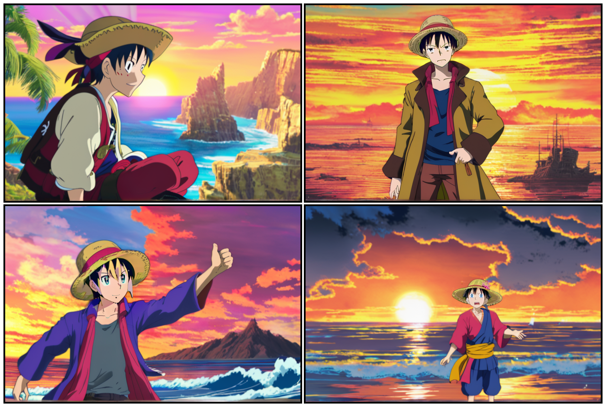
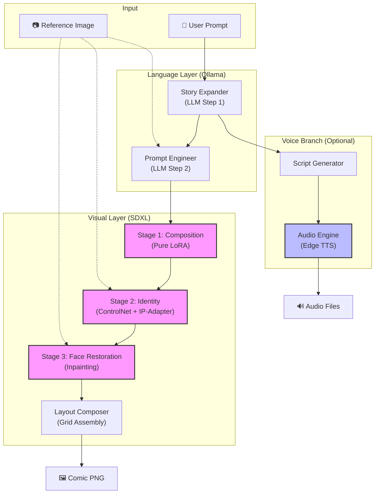

# 🎨 SDXL Manga Generator



> **Story Expansion → Prompt Engineering → Two-Stage Generation (Identity Fix) → Layout Composer**  
> _Optional: High-fidelity TTS Voice Branch_

An advanced end-to-end pipeline that turns a one-line story idea and a character reference image into a professional comic page — powered by local LLMs (Ollama) and SDXL with a specialized identity-preserving two-stage workflow.


```mermaid
flowchart TD
    subgraph Input
        A["📷 Reference Image"]
        B["💬 User Prompt"]
    end

    subgraph "Language Layer (Ollama)"
        C["Story Expander\n(LLM Step 1)"]
        D["Prompt Engineer\n(LLM Step 2)"]
    end

    subgraph "Visual Layer (SDXL)"
        E["Stage 1: Composition\n(Pure LoRA)"]
        F["Stage 2: Identity\n(ControlNet + IP-Adapter)"]
        FX["Stage 3: Face Restoration\n(Inpainting)"]
        G["Layout Composer\n(Grid Assembly)"]
    end

    subgraph "Voice Branch (Optional)"
        H["Script Generator"]
        I["Audio Engine\n(Edge TTS)"]
    end

    B --> C
    C --> D
    D --> E
    E --> F
    F --> FX
    FX --> G
    
    C --> H
    H --> I
    
    A -.-> D
    A -.-> F
    A -.-> FX
    
    G --> K["🖼️ Comic PNG"]
    I --> L["🔊 Audio Files"]

    style E fill:#f9f,stroke:#333,stroke-width:2px
    style F fill:#f9f,stroke:#333,stroke-width:2px
    style FX fill:#f9f,stroke:#333,stroke-width:2px
    style I fill:#bbf,stroke:#333,stroke-width:2px
```

---

## ✨ Features

- **🚀 Two-Stage Generation** — Solves character identity drift by separating composition (Stage 1) from identity refinement (Stage 2: ControlNet + IP-Adapter).
- **🎭 Character Consistency** — Combines Reference Images, IP-Adapter (Base/FaceID), and LoRA auto-loading.
- **👁️ Face Restoration** — Integrated post-processing to ensure sharp, non-distorted character faces.
- **🎙️ Voice Branch** — Automatically extracts scripts and synthesizes high-quality audio for every panel.
- **⚡ Prompt Caching** — Save/Load panel prompts to eliminate LLM variance during A/B testing.
- **🛠️ Drop-in LoRA** — Automatic discovery of `.safetensors` in `loras/` folders.
- **🧩 Fixed Layouts** — Dynamic 4-panel (2×2) or 6-panel (3×2) grids with comic-style aesthetics.

---

## 📁 Project Structure

```text
sdxl-manga-gen/
├── main.py                          # CLI entry point
├── app.py                           # Gradio web UI
├── config.yaml                      # Core pipeline configuration
│
├── pipeline/
│   ├── story_expander.py            # Idea → Panel narratives (LLM 1)
│   ├── prompt_engineer.py           # Narratives → SD Tags (LLM 2)
│   ├── sd_generator.py              # Two-stage SDXL + IP-Adapter + ControlNet
│   ├── script_generator.py          # Narratives → Dialogue scripts (Voice Branch)
│   ├── audio_engine.py              # Script → Audio files (Edge TTS)
│   ├── layout_composer.py           # Panel images → Comic grid
│   └── manga_pipeline.py           # Orchestrator
│
├── loras/
│   ├── character/                   # Drop character LoRAs here
│   └── style/                       # Drop style LoRAs here
│
└── output/                          # Comics, Logs, and Audio
```

---

## 🚀 Quick Start

### 1. Install Dependencies

```bash
pip install -r requirements.txt
```

### 2. Configure

Set your models in `config.yaml`. The pipeline defaults to **DreamShaper XL** and **Ollama**.

```yaml
llm:
  model_name: "qwen3:8b"

sd:
  model_path: "Lykon/dreamshaper-xl-1-0"
  two_stage:
    enabled: true
    edge_detector: "hed"  # canny or hed
```

### 3. Run

```bash
# Basic run with reference image
python main.py -r ref.png -p "A samurai fighting a robot in the rain"

# Run with TTS audio and fixed seed
python main.py -r ref.png -p "Cyberpunk heist" --audio --seed 42

# Use prompt cache to keep LLM results fixed across runs
python main.py -p "..." --prompt-cache cache.json
```

---

## 🔧 Deep Dive: Two-Stage Pipeline

To achieve high-quality results with consistent characters, we use a specialized **Two-Stage** approach:

1.  **Stage 1: Composition (Pure LoRA)**  
    Generates the initial scene layout using text prompts and style LoRAs. Identity scale is set to 0 to prevent IP-Adapter interference with composition.
2.  **Stage 2: Identity (ControlNet + IP-Adapter)**  
    Extracts edges (Canny/HED) from Stage 1. Re-runs generation with low denoising and active IP-Adapter to "nudge" the character features toward the reference image.
3.  **Stage 3: Face Restoration**  
    Detects faces and performs specialized inpainting to fix distortion.

---

## ⚙️ Configuration Reference (`config.yaml`)

| Section | Key | Description |
|---|---|---|
| `llm` | `model_name` | Ollama model for story/prompting |
| `sd.ip_adapter` | `type` | `base` or `faceid_plus_v2` |
| `sd.two_stage` | `enabled` | Toggle identity-preserving two-stage flow |
| `sd.two_stage` | `edge_detector` | `canny` or `hed` geometry guidance |
| `sd.face_restoration`| `enabled` | Toggle automated face fixing |
| `tts` | `enabled` | Toggle automatic voice synthesis |
| `panels` | `auto_threshold`| Word count before switching 4 -> 6 panels |

---

## 📋 Requirements

- **Python 3.10+**
- **Ollama** running locally.
- **GPU** (NVIDIA CUDA or Apple Silicon MPS).
- **ControlNet Weights** for SDXL (auto-downloaded or local).

---

## 📄 License

MIT
